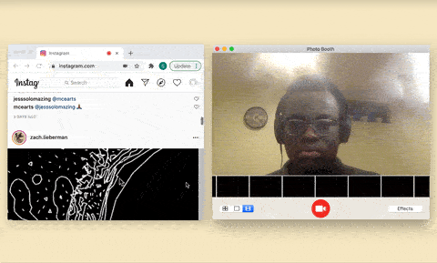

# ☝🏽Gesture-Based Instagram Liker with Teachable Machine

Like Instagram photos using Teachable Machine and Google Chrome extension content scripts.

## Basic Usage

- Navigate to `chrome://extensions`
- Enable "Developer mode"
- Click "Load unpacked" and select this folder
- Go to Instagram!

## Changing The Model

- Go to [Teachable Machine](https://teachablemachine.withgoogle.com/train/image) and train an image model
- *Make sure that one of the models classes is "Thumbs Up"* unless you plan on changing the the value in `content-scripts.js`.
- Click "Export model" and "Upload model"
- After your model is finished loading, copy the model url
- Go to `content-scripts.js` and change `URL` to your new model url
- Hit the refresh icon on your extension in `chrome://extensions`
- Reload Instagram

## Resources

- [Teachable Machine](https://teachablemachine.withgoogle.com/train/image)
- [Google Chrome Extension Content Scripts](https://developer.chrome.com/extensions/content_scripts)
